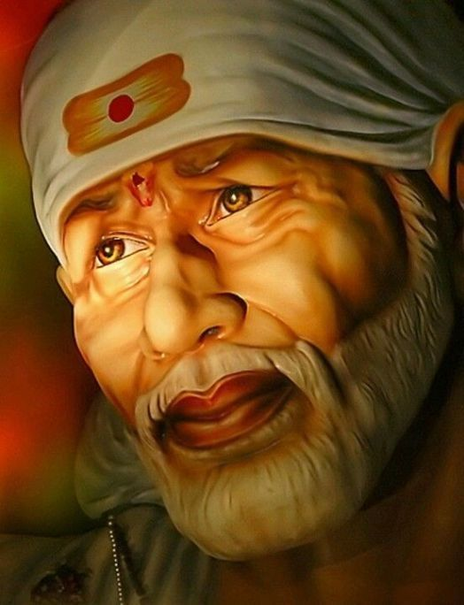

# Assignment2-Ginjupalli
# Navya Sahithi Ginjupalli
###### Mysore 

The Mysore Palace, officially known as **Mysuru Palace**, is a historical palace and the royal residence (house) at Mysore in the Indian state of Karnataka. **It is the official residence of the Wadiyar dynasty and the seat of the Kingdom of Mysore**.

***

## Directions from Maryville to Mysore

1. Take a Car from marryville to kansas airport 
2. Take a flight from kansas airport to Texas airport
3. From Texas  take a flight to Delhi
    1. From Delhi take a flight to Bangalore
    
Items that can be brought to my favourite place for maximum enjoyment.

* Money
* Food
* Badminton kit
* Playing Cards
* Drinks

***

[link to AboutMe](https://github.com/nsginjupalli/Assignment2-Ginjupalli/blob/e4b849659a86156cb5c48232d16588fb30495382/AboutMe.md)

***

### Tables represent the food items i would recommend.

| Dish | Locality | Prices |
| :---: | :---: | :---: |
| Biriyani | Paradise | $5 |
| Frankiee | ForumMall | $2 |
| Coconut milk | DLF | $3 |
| Kaju Burfi| Sweet Magic | $4 |

***

### My Inspiring Quotes

> The Battles you fight, Shape the warrior you  become!! -*Bhagath Singh*

> The secret of getting ahead... is getting started! -*Mark Twain*

> Don't be Afraid to give up the good to go for the great! -*John D.RockeFeller*

***
### Code Fencing

#### Graph Spanning Cycle

> A spanning subgraph is a subgraph that contains all the vertices of the original graph. A spanning tree is a spanning subgraph that is often of interest. A cycle in a graph that contains all the vertices of the graph would be called a spanning cycle. However it's more common name is a Hamiltonian cycle.

[ Graph Spanning Cycle](https://www.edmath.org/MATtours/discrete/concepts/csubgr.html)

    int n;  
    vector<vector<int>> adj;  
    vector<char> color;  
    vector<int> parent;  
    int cycle_start, cycle_end;  

    bool dfs(int v) {  
        color[v] = 1;  
        for (int u : adj[v]) {  
            if (color[u] == 0) {  
                parent[u] = v;  
                if (dfs(u))  
                    return true;  
            } else if (color[u] == 1) {  
                cycle_end = v;  
                cycle_start = u;  
                return true;  
            }  
        }  
        color[v] = 2;  
        return false;  
    }  

    void find_cycle() {  
        color.assign(n, 0);  
        parent.assign(n, -1);  
        cycle_start = -1;  

        for (int v = 0; v < n; v++) {  
            if (color[v] == 0 && dfs(v))  
                break;  
        }  

        if (cycle_start == -1) {  
            cout << "Acyclic" << endl;  
        } else {  
            vector<int> cycle;  
            cycle.push_back(cycle_start);  
            for (int v = cycle_end; v != cycle_start; v = parent[v])  
                cycle.push_back(v);  
            cycle.push_back(cycle_start);  
            reverse(cycle.begin(), cycle.end());  

            cout << "Cycle found: ";  
            for (int v : cycle)  
                cout << v << " ";  
            cout << endl;  
        }  
    }  

    [Code Soure](https://cp-algorithms.com/graph/finding-cycle.html)

